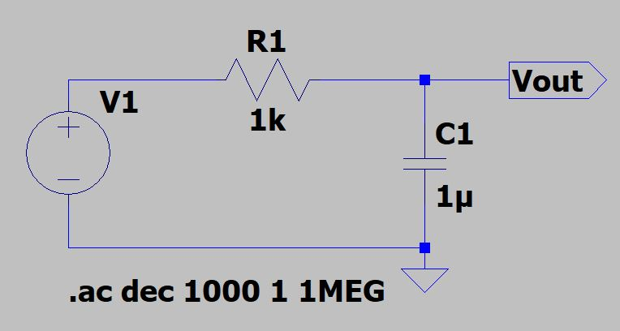

# analog-filters
Transfer functions, bode plots, zero plots of different type of Analog Filters are in this repository can be used as a study aid for Analog and Digital Signal Processing lecture

## RC Low Pass Filter

